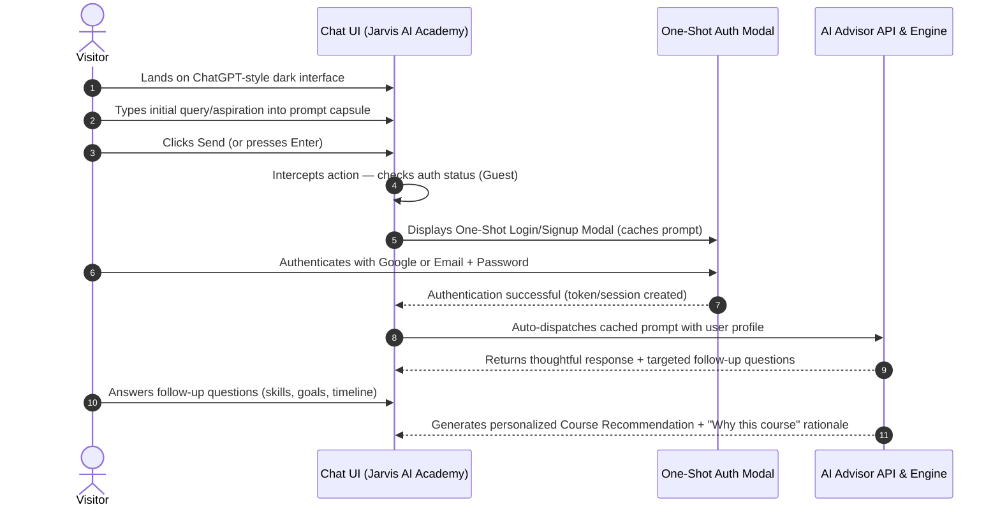

# Jarvis AI Academy — Project Context & Blueprint

> **Notice**: This document maintains the living architectural, business, and domain context for **Jarvis AI Academy**. Whenever new guidelines or requirements are provided, they are appended to the [Context Evolution Log](#context-evolution-log).

---

## 1. Project Vision & Identity

- **Brand Name**: **Jarvis AI Academy** (formerly *Codexa Classes*).
- **Core Positioning**: A ChatGPT-inspired conversational AI platform acting as an intelligent academic and career advisor.
- **Goal**: Engage visitors immediately through a polished, dark-first chat experience, guide them through a conversational career/skill assessment, and match them with personalized tech courses from our academy catalog.
- **Rebranding Directive**: Any legacy reference to **Codexa Classes** or **Codexa** is strictly replaced with **Jarvis AI Academy**.

---

## 2. End-to-End User Journey

### Flow Breakdown:
1. **Landing State**:
   - Visitors are greeted with a ChatGPT-style dark-first interface (hero prompt capsule, model pill, sample starters).
2. **Trigger & Gate**:
   - Visitors can type whatever questions, aspirations, or background they have.
   - Upon pressing Send, the prompt is cached in application state (`pendingPrompt`), and the **One-Shot Auth Modal** is presented.
3. **One-Shot Account Creation & Login**:
   - Unified flow: Signing up and logging in share a seamless single modal (Google OAuth, Apple, or Email + Password).
4. **Preserved Prompt Dispatch**:
   - Immediately following successful authentication, the pending prompt is automatically transmitted to the backend API without requiring the user to retype it.
5. **Interactive Consultation & Follow-up Questions**:
   - The AI responds contextually to the user's initial inquiry and responds with follow-up questions to understand their current skill level, career target, and preferred learning pace.
6. **Course Recommendation & Justification**:
   - Based on the user's responses, our prompt engineering engine synthesizes a personalized course recommendation with clear reasons why it matches their career path.

---

## 3. Course Catalog & Curricula Reference

All training programs reference the proven curriculum from the previous repository (`/home/sugat/Documents/vk/codexa-website/frontend/*`), rebranded under **Jarvis AI Academy**:

| Course / Track | Tech Stack | Core Topics & Focus |
| :--- | :--- | :--- |
| **Frontend Engineering** | HTML5, CSS3, JavaScript, Tailwind CSS, React JS | Modern responsive UI, React components, state management, interactive web apps. |
| **Backend Engineering** | Python, FastAPI, Django, REST APIs | Backend system design, API development, auth flows, database connections. |
| **Database Engineering** | MySQL, PostgreSQL, MongoDB | Relational & NoSQL database architecture, queries, indexing, data modeling. |
| **Full-Stack Web Development** | React, Python/Node, Databases, Cloud | Comprehensive end-to-end web development with real-world industry capstones. |
| **Super10 Signature Program** | Intensive Full-Stack & AI Stack | Elite placement batch with mentorship, live project production, and job guarantee. |

---

## 4. Prompt Engineering Strategy

The advisor model uses structured prompt chaining:
1. **Intent & Persona Detection**: Determine if the student is a fresher, college student, non-IT switcher, or working engineer seeking upskilling.
2. **Follow-Up Inquiries**: Ask 1–2 sharp, friendly questions regarding:
   - Current familiarity with programming.
   - Dream career role (e.g. Frontend Developer, Backend Engineer, Full-Stack AI Engineer).
   - Time commitment availability.
3. **Course Recommendation Output**:
   - **Recommended Course**: Exact course title from the Jarvis AI Academy catalog.
   - **Key Modules**: Why these modules bridge their current knowledge gap.
   - **Rationale ("Why this course")**: Direct linkage to their personal career goal.
   - **Call-to-Action**: Option to view syllabus, request a callback, or enroll.

---

## 5. Context Evolution Log

| Date & Time | Source | Context Added |
| :--- | :--- | :--- |
| **2026-09-12 23:30** | User Directive | Defined core funnel: Visitor lands on ChatGPT UI → types prompt → forced one-shot login/signup (Google / Email+Pass) → prompt auto-sent to API → conversational follow-up questions → final course recommendation based on old Codexa Classes curriculum → Rebrand all occurrences of Codexa Classes to Jarvis AI Academy → Initialized persistent `PROJECT_CONTEXT.md`. |
